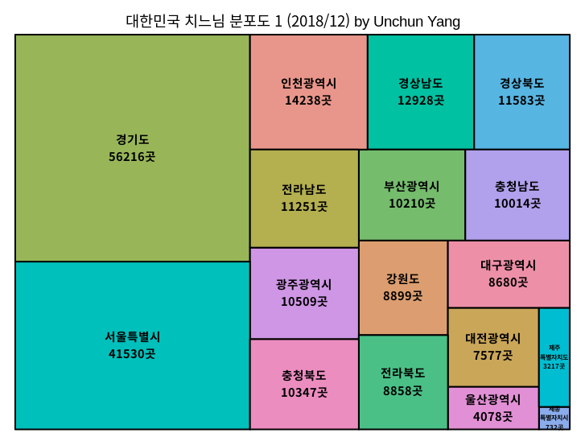
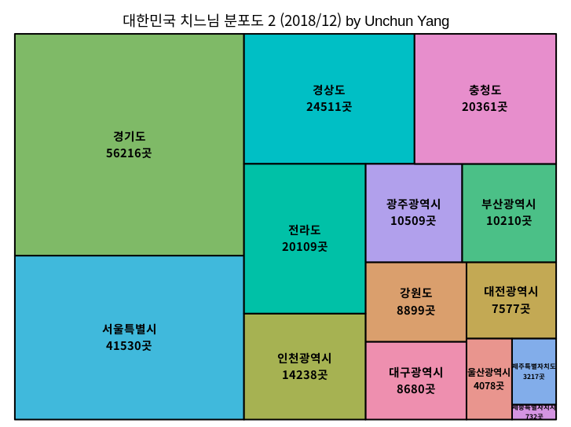
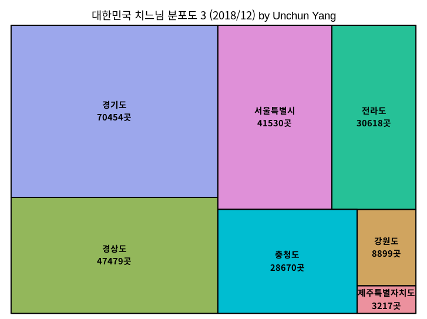
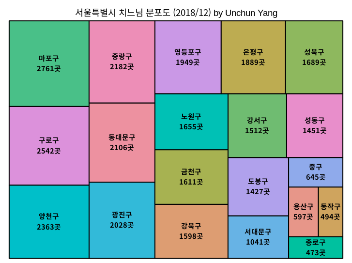
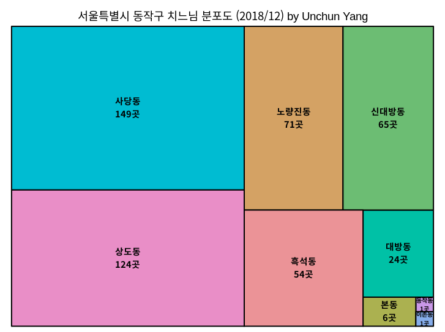
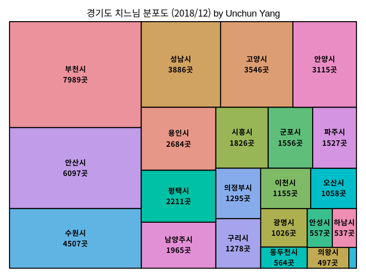
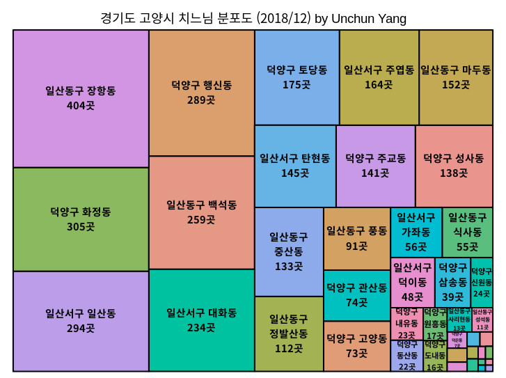

# R-Love-Chicken

대한민국 치킨 분포도

## 결과 이미지

### 전국 분포도1

### 전국 분포도2

### 전국 분포도3

### 서울특별시 분포도

### 서울특별시 동작구 분포도

### 경기도 분포도

### 경기도 고양시 분포도

## 참고

- [처음 시작하는 R 데이터 분석](https://github.com/newstars/HelloR)
- [지방행정인허가데이터개방](https://www.localdata.go.kr/)
